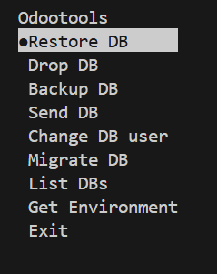
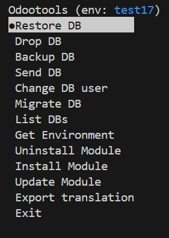

## Installation

Install via pip
```sh
pip install git+https://github.com/NachoCodeseda/odootools
```

## Usage
Use the otools command in terminal
```sh
otools
```


Select ``Get Environment`` to manage modules installations and export translation



### Environment

Get an instance of odoo environment to test methods or view data

> [!NOTE]
> The Tools library only works with following directory structure. Working on better implementation

´´´
─ /opt/odoo[version]  /opt/odoo17 for example
  └ /odoo             odoo repository
  └ odoo.conf         odoo conf file
  └ file.py           file where odootools.utils is imported
´´´

```py
from odootools.utils import Tools, odoo

with Tools('test17') as tool:
    env = tool.get_env()
    move_ids = env['account.move'].search([('state', '=', 'posted')])
    move_ids.action_post()
    env.cr.commit() # Save the changes on DB
```