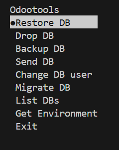
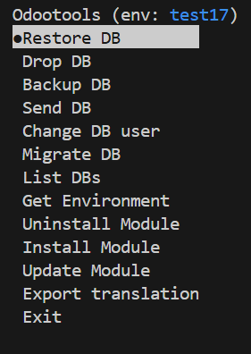

## Installation

Install via pip
```sh
pip install git+https://github.com/NachoCodeseda/odootools
```

## Usage
Use the `otools` command in terminal
```sh
otools
```


Select `Get Environment` to manage module installations and export translations



---

## Odoo Installation Discovery

`odootools` automatically finds your Odoo installation. No fixed directory structure required.

It searches in this order:

| Priority | Strategy | Example |
|----------|----------|---------|
| 1 | `ODOO_PATH` / `ODOO_CONF` environment variables | Override for any layout |
| 2 | Odoo importable in the current Python environment | `pip install odoo`, venvs |
| 3 | Parent directories of the script being run | Installed inside `/opt/odoo18/custom_addons/…` |
| 4 | `odoo-bin` in system `PATH` | `which odoo-bin` |
| 5 | Glob search under `/opt`, `/usr/local`, `~` | Standard `/opt/odoo18/` installs |

You can always override automatic detection:

```sh
ODOO_PATH=/srv/myodoo ODOO_CONF=/etc/myodoo.conf otools
```

The `odoo.conf` file is searched near the discovered `odoo-bin`, then in `/etc/odoo/odoo.conf`, `/etc/odoo.conf`, and `~/.odoorc`.

---

## Environment (scripting API)

The `Tools` class gives you an Odoo environment for scripting, Jupyter notebooks, or batch operations. It works with any Odoo installation that the discovery above can find.

```py
from odootools.utils import Tools, odoo

with Tools('my_database') as tool:
    env = tool.get_env()
    move_ids = env['account.move'].search([('state', '=', 'posted')])
    move_ids.action_post()
    env.cr.commit()  # Save changes to DB
```

You can also pass the conf file explicitly:

```py
with Tools('my_database', odoo_conf='/path/to/odoo.conf') as tool:
    env = tool.get_env()
    ...
```

### Report generation (Odoo 12–19)

```py
with Tools('my_database') as tool:
    # Generic report — full XML ID required
    tool.print_report('sale.action_report_saleorder', res_id=42, report_file='order.pdf')

    # Built-in shortcuts
    tool.print_sale_order(42)    # → sale_order.pdf
    tool.print_invoice(7)        # → invoice.pdf
    tool.print_delivery(3)       # → delivery.pdf
    tool.print_picking(5)        # → picking.pdf
    tool.print_packages(5)       # → packages.pdf
```

### Module management

```py
with Tools('my_database') as tool:
    tool.uninstall_module('my_module')
    tool.uninstall_module(['mod_a', 'mod_b'])
```

### XML record reload (report editor workflow)

```py
with Tools('my_database') as tool:
    # Reload an XML file and regenerate a PDF on each iteration — useful for template development
    tool.report_editor(
        module_name='my_module',
        report_file='report/my_report.xml',
        action_xml_id='action_report_my_model',
        res_id=1,
        file_name='preview.pdf',
    )
```

---

## Compatibility

| Feature | Odoo versions |
|---------|---------------|
| Report rendering | 12–13 (`render_qweb_pdf`), 14–16 (`_render_qweb_pdf` on record), 17+ (`_render_qweb_pdf` as model method) |
| XML import (`convert_file`) | 12–16 (cursor-based), 17+ (environment-based) |
| Database neutralization | 15+ (via `odoo.modules.neutralize`) |
| All other features | 12–19+ |
